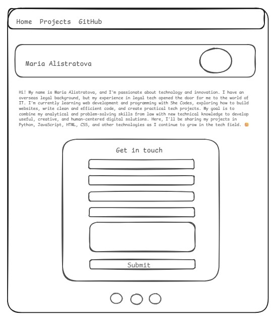
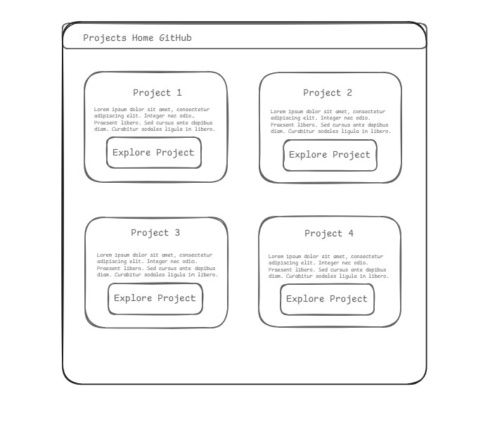

## MariaCodes Portfolio Website Maria Alistratova 
Personal portfolio website showcasing my transition into software development, technical projects, and professional background.

🌐 Live Site: [(My_portfolio_site)](https://www.mariacodes.dev/)
​
### Overview

This responsive portfolio website was designed and developed to present my software development projects, technical skills, and professional experience. The site serves as a central hub where potential employers, recruiters, and collaborators can learn more about my work and easily get in touch.
​
### Key Features

- Responsive design for desktop and mobile devices
- Professional "About Me" section
- Dedicated Projects page featuring portfolio projects
- Interactive contact form with real-time validation
- Country selector with dynamic custom-country input
- Social media and GitHub integration
- Hover animations and interactive UI elements
- Email notifications for contact form submissions
- Firebase Firestore database integration

### Technologies Used

- HTML5
- CSS3
- JavaScript (ES6)
- Firebase Firestore
- EmailJS
- Git & GitHub
- Responsive Web Design

### Featured Projects

#### JobTracker

A collaborative job application management platform featuring Kanban boards, interview tracking, calendar scheduling, contacts, notes, and task management.

#### Fundraising Platform

A full-stack crowdfunding platform with user authentication, initiative management, donation tracking, and administrative controls.

#### Weather Analytics Application

A Python-based weather reporting tool that processes CSV datasets and generates weather reports through an interactive web interface.

#### Task Manager

A JavaScript productivity application with task creation, deadline tracking, editing, and completion management.

### Contact Form Integration

The website uses Firebase Firestore to securely store contact form submissions and EmailJS to deliver instant email notifications whenever a visitor submits a message.

### What I Learned

This project strengthened my skills in:

- Front-end development
- Responsive design
- Form validation
- Firebase integration
- Third-party API integration
- User experience design
- Git version control
- Website deployment

### Author

Maria Alistratova

Portfolio:  [(My_portfolio_site)](https://www.mariacodes.dev/)
GitHub: [(My_GitHub)](https://github.com/Haveatrytolearn)
LinkedIn: [(My_LinkedIn)](https://www.linkedin.com/in/maria-alistratova/)

### Screenshots

#### 1. Homepage layout

#### 2. Projects page layout

#### 3. Navigation menu displayed on every page

#### 4. Introduction section with profile photo

#### 5. Default view of the contact form

#### 6. Contact form with the additional field shown when “Another country” is selected

#### 7. Social media icons section

#### 8. Project cards on the second page

